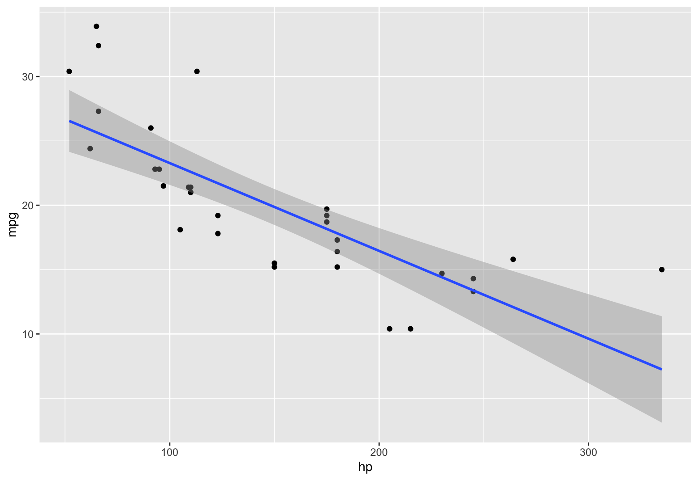

# Claude-R

Agentic R programming with Claude Code (or OpenCode) and RStudio.

This repo is an **R project template**. Clone it for each R project, and you get a ready-made environment where the assistant manages the RStudio connection via MCP. Your R scripts, data, and analysis all live in the same repo.

**Supported clients:** [Claude Code](https://code.claude.com/docs) and [OpenCode](https://opencode.ai/) (an open-source alternative to Claude Code).

```
You → Claude Code or OpenCode → MCP Server → RStudio
```

## Requirements

- macOS (Linux untested, Windows unsupported)
- [Claude Code](https://code.claude.com/docs) or [OpenCode](https://opencode.ai/)

## Quick Start

In any terminal:

```bash
# Clone per project (each clone becomes its own R project workspace)
git clone https://github.com/naoto-iwase/Claude-R.git <your-project-name>
cd <your-project-name>

# Detach from the template repo so this becomes your own project
git remote remove origin
```

### With Claude Code

```bash
claude
# Then ask: "Set up Claude-R"  or  /claude-r
```

### With OpenCode

```bash
opencode
# Then ask: "Set up Claude-R"  or  /skills → claude-r
```

## Example

In the assistant, you type:

```
"Plot mpg vs hp from mtcars with a regression line"
```

The assistant generates and executes:

```r
library(ggplot2)
ggplot(mtcars, aes(x = hp, y = mpg)) +
  geom_point() +
  geom_smooth(method = "lm")
```

The plot appears in RStudio's Plots pane, and the assistant shows the result inline.



Other things you can ask:

```
"Run a t-test comparing groups A and B"
"Load data.csv and show summary statistics"
```

## Troubleshooting

If something goes wrong, ask the assistant:

```
"Check Claude-R connection"
"Troubleshoot Claude-R setup"
```

## Documentation

- [SKILL.md](.claude/skills/claude-r/SKILL.md) - Complete setup and usage guide
- [Troubleshooting](.claude/skills/claude-r/references/troubleshooting.md) - Common issues and fixes
- [Architecture](.claude/skills/claude-r/references/architecture.md) - System design and data flow

## License

MIT

## Credits

Built on [ClaudeR](https://github.com/IMNMV/ClaudeR) by IMNMV.
